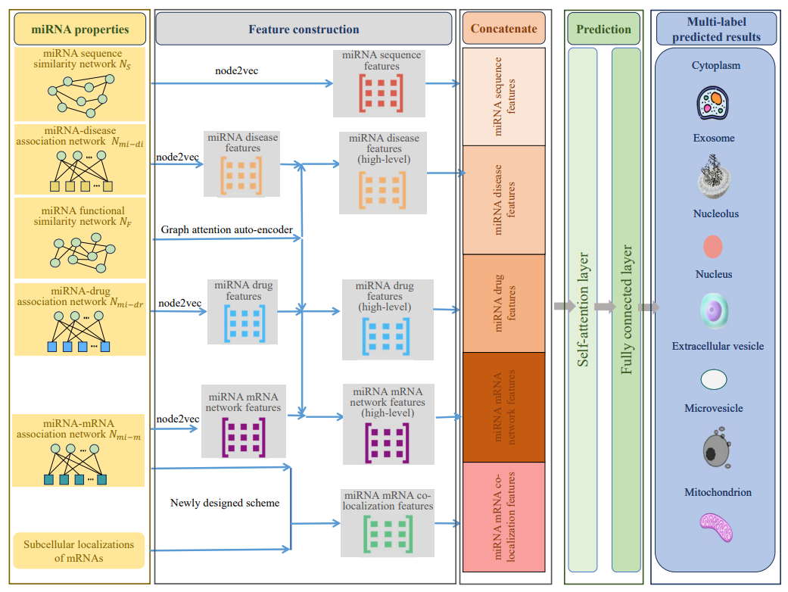

# PMiSLocMF

The PMiSLocMF is designed for the prediction of miRNA subcellular localizations. Several miRNA properties are employed to extract informative miRNA features, including miRNA sequence and functional similarity networks, miRNA-disease, miRNA-drug, and miRNA-mRNA association networks. The powerful algorithms (node2vec and graph attention auto-encoder) and one newly designed scheme are adopted to generate four miRNA feature types. These features are fed into the self-attention and fully connected layers to make predictions.

## Datasets
The 'datasets' folder contains the raw data used in PMiSLocMF. Their specific sources are detailed in the paper. The following is a brief introduction on each file:

- miRNA_ID_1041.txt: The IDs of the 1041 miRNAs used in PMiSLocMF
- miRNA_disease.csv: The association between 1041 miRNAs and 640 diseases
- miRNA_drug.csv: The association between 1041 miRNAs and 130 drugs
- miRNA_mRNA_matrix.txt: The association between 1041 miRNAs and 2836 mRNAs
- miRNA_seq_sim.csv: The sequence similarity among the 1041 miRNAs
- miRNA_func_sim.csv: The functional similarity among the 1041 miRNAs
- miRNA_localization.csv: The subcellular localization of 1041 miRNAs
- mRNA_localization.txt: The subcellular localization of 2836 mRNAs
- miRNA_have_loc_information_index.txt: The indices of the 1041 miRNAs with localization information

## Feature

The 'feature' folder contains the feature data used in PMiSLocMF. The following is a brief introduction on each feature file:

- miRNA_seq_feature_64.csv: MiRNA sequence features extracted from miRNA sequence similarity network through Node2Vec
- miRNA_disease_feature_128.csv: Raw miRNA disease features extracted from miRNA-disease association network through Node2vec 
- miRNA_drug_feature_128.csv: Raw miRNA drug features extracted from miRNA-drug association network through Node2vec
- miRNA_mRNA_network_feature_128.csv: Raw miRNA mRNA features extracted from miRNA-mRNA association network through Node2vec
- miRNA_mRNA_co-localization_feature.csv: MiRNA mRNA co-localization features extracted from miRNA-mRNA association network
- gate_feature_disease_0.8_128_0.01.csv: High-level miRNA disease features improved by GATE
- gate_feature_drug_0.8_128_0.01.csv: High-level miRNA drug features improved by GATE
- gate_feature_mRNA_0.8_128_0.01.csv: High-level miRNA mRNA features improved by GATE

## Code

The 'code' folder contains the relevant codes used in PMiSLocMF. The 'feature_extraction' folder includes the source code for feature extraction, and 'main.py' is the source code for the model.

## Requirements
- python = 3.7.16
- Tensorflow = 2.11.0
- scikit-learn = 1.0.2
- node2vec = 0.4.3
- networkx = 2.6.3

## Quick start

Run code/main.py to Run PMiSLocMF